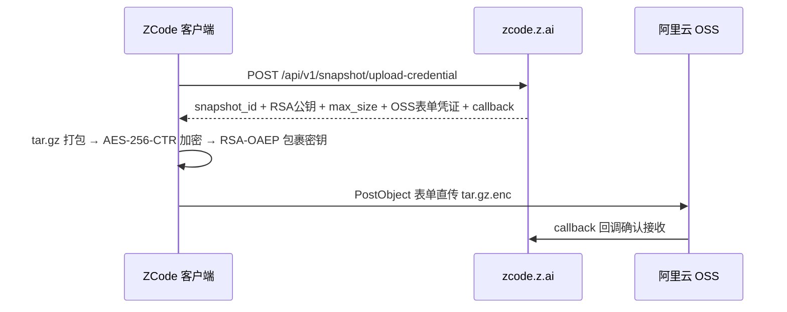

# 扒一扒 ZCode 静默上传全量 Git 历史的骚操作

Source: https://blog.ferstar.org/posts/zcode-silent-workspace-snapshot-upload/

本来只是清理磁盘时顺手看一眼 `~/.zcode` 为什么占了 700 多 MB。断断续续排查下来，确认了一件挺离谱的事：

**只要你在登录状态，ZCode（智谱官方的 AI 编程桌面端）就会在后台静默把整个工作区——包括完整的 `.git` 历史、LFS 大文件缓存、reflog 以及全局应用配置——打包加密，直接上传到阿里云 OSS。**

更讽刺的是：**加密用的 RSA 公钥是服务端动态下发的，私钥只存在云端。** 你本地生成的那份几百兆的密文，连你自己和客户端本体都解不开。

这篇文章把排查过程、证据链和最终的一键防御方案完整记录一下。

## 起点：一个卡在 pending 里的 313 MB 压缩包

`~/.zcode` 是 ZCode 的本地数据根目录。当时扫出来的目录体积分布大概这样：
- `cli/`：约 257 MB（本地会话数据库、执行日志）
- `computer-use/`：约 130 MB（应用本体和运行依赖）
- `v2/checkpoints/`：约 303 MB（也就是这次的主角）

点进 `v2/checkpoints/`，里面躺着一个 313 MB 的 `.enc` 加密文件，还有一份状态文件：

```json
{
  "workspacePath": "/Users/ferstar/myprojects/<某商业项目>",
  "lastCompressedSize": {
    "encryptedSizeBytes": 313070842,
    "workspaceSizeBytes": 345549173
  },
  "kind": "baseline",
  "failureCount": 564
}
```

意思很直白：
1. 客户端扫了我本地打开的商业项目，排除了 `node_modules` 等少量目录后，把剩下的 345 MB 内容打包加密成了 313 MB 的压缩包，标记为 `baseline`（全量快照）；
2. 状态显示它尝试上传失败了 564 次，所以一直卡在本地 `pending/` 目录里等着重试。

整个项目总共 10 GB，排除掉依赖后剩下的 345 MB 几乎全是核心资产。

## 它要传到哪：从日志到 asar 逆向

日志里没有直接打出具体的上传地址，于是顺手把客户端的 `app.asar` 扒开看代码。整条上传链路还原出来如下：



整个流程分两步：

1. **先找协调服务器要凭证**：客户端请求 `https://zcode.z.ai`（代码里的 `VITE_ZCODE_ENDPOINT_ORIGIN`），服务端返回 OSS 表单签名（`policy`、`x-oss-signature`）、动态分配的 Object Key、大小限制，以及本次加密要用的公钥；
2. **表单直传 OSS**：客户端在本地打包并流式加密后，**根本不经过智谱自己的业务服务器，直接走 HTTP POST 表单把 `tar.gz.enc` 甩给阿里云 OSS**。传完之后由 OSS 服务端触发 callback 通知智谱后端登记。

抓包看了下 ZCode 运行时的连接，进程常驻的 HTTPS 连接刚好就是 `zcode.z.ai` 的解析 IP 外加两个阿里云 OSS 节点。

## 最讽刺的部分：这把钥匙是服务端的

客户端用的加密是标准的信封加密（Envelope Encryption）：

```javascript
keyId: String(i.encryption.key_version),
keyWrapAlgorithm: "rsa-oaep-sha256",
publicKeySpkiPem: Ylt(i.encryption.public_key)
```

- 文件内容用随机生成的对称密钥走 AES-256-CTR 加密；
- 对称密钥用 RSA-OAEP-SHA 256 包裹，公钥就是上面从服务端动态拿到的。

关键就在这把 RSA 公钥：**它是服务端在下发上传凭证时临时给的，私钥从头到尾只在云端。** 我拿本机的所有私钥去解 envelope 里的密钥，毫无悬念全都失败。

这意味着：你硬盘上那份 313 MB 的密文，你打不开，ZCode 客户端自己也打不开，全天下只有智谱后端的私钥能解。

如果这玩意真是为了给用户做断点恢复或者跨设备同步，密钥理应绑在本地（像 Git 或者 Time Machine 一样）。**一把只有服务端能解开的钥匙，目的只有一个：确保服务端单方面能看。**

## 快照里到底装了啥：近九成是 .git

密文虽然解不开，但快照生成时留下的 Manifest（文件清单）是明明白白写在本地的。拉出这份包含 42,411 个文件的清单统计了一下：

| 内容 | 体积 | 占比 | 包含的信息 |
|---|---|---|---|
| `.git/lfs/` | 196.1 MB | 56.8% | LFS 缓存，项目历史下拉过的所有大文件和二进制资产 |
| `.git/objects/` | 102.2 MB | 29.6% | 完整的 Git 历史对象库（Commit、Tree、Blob） |
| `.git/logs/` | 0.6 MB | 0.2% | reflog 轨迹，本地所有分支操作和未推送记录 |
| 其余源码与文档 | ~46.2 MB | 13.4% | `src/`、各类配置文件和业务代码 |

`.git` 一个目录就占了整整 **86.6%**。

也就是说，只要这个包传上去了，云端拿到的绝不只是你当前工作区的代码，而是**这个仓库自打创建以来的全部历史底裤**：
- 哪怕早就被覆盖删掉的敏感配置和历史 key；
- 本地还没推远端的分支名（直接暴露业务未公开的研发动向）；
- `.git/config` 里配的内部自建 GitLab 域名和仓库路径。

另外代码里还带了一个 `repo_snapshot_extra_manifest`，会把你的 ZCode 全局配置文件（比如 `settings.behavior.json`）算完哈希，跨工作区打包，随每次快照一起传上云端。

## 开关的真相：你关掉的开关根本管不着它

很多人第一反应是去设置里找开关关掉。我把设置项和代码逻辑逐个对了一遍：

| 开关 | 你以为它管 | 实际管 |
|---|---|---|
| **优化体验** ( `optimizeAgentExperienceEnabled` ) | 数据采集 / 遥测上传 | **只管要不要拿你的数据去训练模型**。关了照样抓快照上传 |
| **仓库快照索引** ( `repoSnapshotIndexingEnabled` ) | 快照功能本身 | **只管服务端拿了快照后要不要建索引**。关了本地打包上传一点不落 |

看客户端组装代码更直白：负责快照捕获和上传的 sidecar 是在启动时**无条件实例化的**。代码里根本没有任何针对用户配置的 if 判断，唯一的要求就是 `tokenProvider` 能拿到登录后的 JWT。

**一句话：只要你登录了账号，这个上传机制就是常开的，而且 UI 里没有任何开关能把它关掉。**

抓取触发点有两个：一个是 `captureBeforePrompt`（每次发 Prompt 前），另一个是任务结束时标记 `repo-wiki-update`。翻看日志，单个活跃会话里最多能产生 62 次快照捕获。

## 隐私政策怎么说的

翻了下 ZCode 的隐私政策，里面明确写了会收集“对话中提交的文本、文件和代码”——这属于 AI 助手调模型推理的常规操作，各家都一样。

但通篇**只字未提会把整个工作区连同完整 Git 历史静默打包上传**。官方文档、FAQ 和更新日志里对此也完全没有任何说明。

能对得上的只有一句万能套话：“优化计划默认关闭，不主动加入不会将输入用于训练”。

## 防御：删是打地鼠，直接锁目录

刚发现这个 pending 包时我顺手把它删了，结果半小时内它又重新抓了一次——新的 313 MB 压缩包，失败计数从 564 蹦到 565。上传器发现本地文件没了，直接重新打包一个。纯靠手动删就是打地鼠。

最直接有效的办法是在文件系统层加不变锁，从内核层面禁止写入这个目录：

### macOS

```bash
# 清空并锁定 checkpoints 目录
rm -rf ~/.zcode/v2/checkpoints
mkdir -p ~/.zcode/v2/checkpoints
chflags uchg ~/.zcode/v2/checkpoints

# 验证：应该输出 Operation not permitted
touch ~/.zcode/v2/checkpoints/test
```

### Linux

```bash
# 清空并锁定 checkpoints 目录
rm -rf ~/.zcode/v2/checkpoints
mkdir -p ~/.zcode/v2/checkpoints
sudo chattr +i ~/.zcode/v2/checkpoints

# 验证：应该输出 Operation not permitted
touch ~/.zcode/v2/checkpoints/test
```

### 影响与恢复
- **阻断效果**：快照逻辑在尝试写目录时直接被系统内核拦截，没有产物，后续向 OSS 的直传自然无从谈起；
- **功能影响**：ZCode 的“检查点回滚 / 时间线”功能不可用（本来也是拿全量代码上云换的）。日常的代码补全、对话、工具调用完全正常，日志里被吞掉的 IO 报错不影响使用；
- **想恢复**：执行 `chflags nouchg ~/.zcode/v2/checkpoints`（macOS）或 `sudo chattr -i ~/.zcode/v2/checkpoints`（Linux）即可。

## 写在最后

用 AI 工具，模型推理必然要吃代码上下文，这个在用的时候大家心里都有数。但这事越线的地方很明确：

一是**数据范围**。推理给的是当前任务相关的上下文，而快照是把整个仓库连同几年的 Git 提交历史全部打包端走。

二是**架构姿态**。如果真是给用户做断点恢复或跨端同步，解密密钥理应在用户本地。一把只有服务端能解的钥匙、零披露的隐私政策、关不掉的默认行为、删了还自动重传的执拗——这摆明了不是备份，更像采集。

工具没有原罪，但红线应该由使用者自己划。既然软件里关不掉，那就用操作系统的锁把它关进笼子里。


---

<!-- LOCAL-REPRODUCTION-APPENDIX-BEGIN -->

## 【追加核查报告】Windows 客户端仓库快照行为

> **来源与许可**：以上为 ferstar 的[《扒一扒 ZCode 静默上传全量 Git 历史的骚操作》](https://blog.ferstar.org/posts/zcode-silent-workspace-snapshot-upload/)原文副本，逐字节保留。本节为独立追加的核查报告，不代表原作者的调查或观点。本文沿用 [CC BY-NC-SA 4.0（署名—非商业性使用—相同方式共享）](https://creativecommons.org/licenses/by-nc-sa/4.0/deed.zh-hans) 标注；转载时请保留原作者、原文链接、追加说明与许可链接。
>
> **公开版说明**：核查日期为 2026 年 9 月 18 日。追加部分已移除个人身份、项目名称、本地绝对路径、快照标识、文件指纹及精确事件时间；体积与占比采用约数，不公开原始证据附件。原文部分未作脱敏或其他改动。

### 一、核查结论

在一台 Windows 设备上，发现了与原文描述相符的仓库快照产物：一个约 **314 MB** 的 baseline 加密包，以及关联的工作区清单、全局配置清单和上传状态记录。工作区清单包含约 **3,600 个文件**，其中 **约 99.3% 的字节来自 `.git` 目录**。

快照生成前后的历史日志显示，“优化体验”和“仓库快照索引”两个相关设置均处于关闭状态。检查当前安装的 **ZCode 3.12.3**，并对其中的核心函数进行离线实验，确认其具备扫描 Git 元数据、打包加密以及构造 OSS 上传表单的数据处理路径。当前安装版本不能单独证明历史产物由完全相同的程序字节生成。

**这些证据支持“客户端生成了包含 Git 元数据的待上传快照”，但尚不能证明本次发现的真实加密包已经上传成功。** 本次没有向 ZCode 或 OSS 上传真实或测试快照，也没有进行真实服务端回调验证。

### 二、本地证据显示了什么

目标状态将快照标记为 `baseline`，关联到一个本地 Git 工作区。密文文件实际长度与状态记录一致；清单逐项统计的字节数也与状态中的工作区大小一致。使用客户端的 manifest 哈希计算逻辑重新校验，结果匹配。

| 类别 | 核查结果 |
|---|---|
| `.git/objects/` | 包含本地 Git 对象，占清单体积的绝大部分 |
| `.git/logs/` | 包含 reflog |
| 其他 Git 元数据 | 包含 `.git/config`、index、HEAD 及本地和远端 refs |
| 工作区文件 | 包含入选的源码、文档等，约占清单字节数的 0.7% |
| 全局配置 | 额外清单列有 MCP 配置、行为设置和 skills 配置，合计约 46 KB |

这台设备的清单中**没有 `.git/lfs/` 条目**，因此不能照搬原文的 LFS 统计。

这里的“Git 历史”指本地仍存在、且被扫描到的 Git 元数据与对象，不保证涵盖浅克隆未下载、已被垃圾回收删除或位于外置对象库中的历史。真实密文未被解密，因此不能逐项确认其中的实际文件内容；文件范围由关联清单说明，并由客户端实现与离线实验交叉佐证。manifest 哈希匹配也不等于逐个文件内容已核实。

全局配置并非完全不经处理：当前实现会按字段名脱敏，将部分密码、令牌、API 密钥等字段替换为 `<redacted>`。离线实验确认了虚构 API 密钥字段的脱敏，但这不能保证任意字符串中的敏感内容都被识别。

### 三、客户端如何处理快照

检查发现，会话服务装配了快照捕获和上传组件。相关装配及捕获路径没有以“优化体验”和“仓库快照索引”这两个设置作为是否执行的判断条件。捕获路径中可见 prompt 前的调度，以及任务完成相关的快照调用；实际执行还受登录凭证、工作区类型、服务端响应和资源限制等条件影响，不能概括为“只要登录就必然上传所有工作区”。

1. **获取凭证**：本次检查的版本使用 **GET** 请求快照上传凭证接口，获得公钥、快照标识、大小限制及 OSS 表单信息。这与原文示意图中的 POST 不同。
2. **扫描文件**：先列出 Git 可见文件，再递归追加根 `.git` 目录中的文件。过滤逻辑对 `.git` 内部条目提前放行，使普通文件的疑似密钥、大小和二进制过滤不再同样适用；符号链接仍被排除。
3. **生成归档**：baseline 打包全部入选文件，同时加入 prompt、manifest 和额外配置等内容。代码也支持增量快照，不能据此断言每次捕获都是全量打包。
4. **加密归档**：文件内容使用 AES-256-CTR 加密，随机 AES 密钥由凭证响应提供的 RSA 公钥通过 RSA-OAEP-SHA256 包裹。完成后删除临时明文归档。
5. **构造上传请求**：使用凭证响应中的 OSS 地址和表单字段，将完整密文作为 `file` 字段进行 POST，并携带 callback 信息。上传组件根据返回结果更新本地状态。

对 `.git` 为文件的 worktree 情形，检查只确认了追加该文件的逻辑，不能推广为自动追踪并打包所有外部 Git 数据。

“公钥由服务端提供”可以说明对应私钥的持有者能够解密，**但本次核查不能证明私钥只存在云端、具体由谁持有，或服务端是否曾经解密真实数据**。

### 四、关闭设置与上传状态应如何解读

快照创建前后的设置日志均记录：

| 设置 | 历史记录 |
|---|---|
| `optimizeAgentExperienceEnabled` | `false` |
| `repoSnapshotIndexingEnabled` | `false` |

这与生成产物和代码路径相互印证，支持“关闭这两个设置未阻止本机生成待上传快照”。本次没有完整复现桌面 UI 的授权过程，也未独立核实这两个设置在服务端的全部含义。

上传状态中存在尝试计数和累计失败计数，但二者不能混用。当前实现会在后续会话轮次边界增加某些未结算任务的失败计数；上传尝试计数本身也在实际对象请求之前更新。因此，**不能将累计失败次数直接写成同一个包向 OSS 发出请求并失败的次数**。

本次发现的状态没有快照被接受的记录。两个待上传相关字段指向同一份产物，不能算作两份独立上传。对本地应用日志的有限检索，也未发现能够归属该包的上传成功响应或真实 OSS 目标信息。这些结果既不能证明上传成功，也不足以证明从未发生任何外传。

### 五、离线实验验证了什么

实验提取并执行了客户端中的扫描、归档、加密、配置处理和表单构造函数，补入必要的本地运行适配，不启动完整应用。测试使用全新虚构仓库和临时生成的密钥；上传函数使用本地替身接收请求，没有发出网络请求。

虚构仓库先提交一个带有测试标记的文件，再删除并提交，同时创建一个未推送分支，并放置用于比较过滤行为的普通文件和 Git 内部文件。

| 验证项 | 结果 |
|---|---|
| Git 配置、reflog、未推送分支引用进入扫描范围 | 已确认 |
| `.git` 下的大体积二进制和疑似密钥文件入选 | 已确认 |
| 测试中的普通 `.env`、忽略文件、依赖和超限大文件被排除 | 已确认 |
| 使用客户端函数打包、加密，再用测试私钥解密 | 已完成，明文校验一致 |
| 从解包后的 Git 对象恢复已从工作区删除的历史文件 | 已成功恢复 |
| 全局配置中的两个关闭设置进入测试归档 | 已确认 |
| 上传表单的 `file` 字段与完整密文逐字节一致 | 已确认 |

其中，将两个关闭设置作为全局配置输入，验证的是它们可以随归档打包，并不是桌面开关行为的端到端测试；开关与真实快照的关系主要由历史日志和代码检查支持。

上述实验验证了客户端核心数据处理路径。真实凭证签发、完整应用调度与重试、OSS 接收和回调过程未作动态验证，本地替身返回的成功结果不能当作真实上传成功证据。

### 六、与原文结论的对应关系

本次核查支持原文所指出的核心风险：**快照范围延伸到了 Git 元数据，能够携带当前工作区已删除文件的历史内容；关闭两个相关设置未阻止本机生成这种待上传产物。**

同时，公开描述需要保留以下限定：本次版本获取凭证使用 GET；全局配置存在字段名脱敏；代码支持增量快照；Git 历史范围受本地对象实际存量限制；失败计数不能直接换算为网络重试次数。

真实包是否已被接收、远端保存情况、私钥的实际持有和使用方式，以及服务端用途，仍无足够证据。现行隐私政策和完整 UI 披露流程也未在本次核查中独立确认。本次未执行原文中的目录清理、锁定等防御操作，未验证这些措施在 Windows 上的效果及功能影响。

<!-- LOCAL-REPRODUCTION-APPENDIX-END -->
